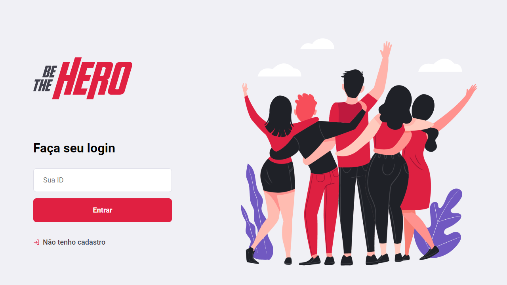
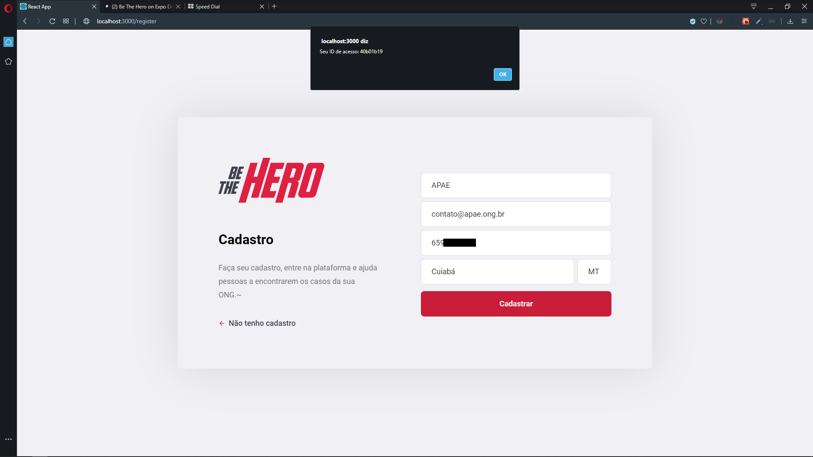
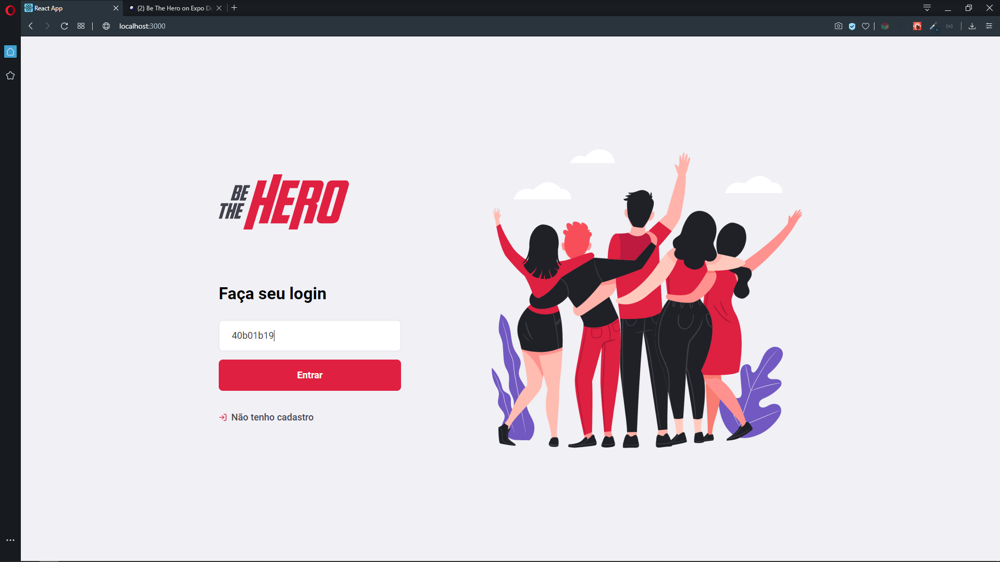
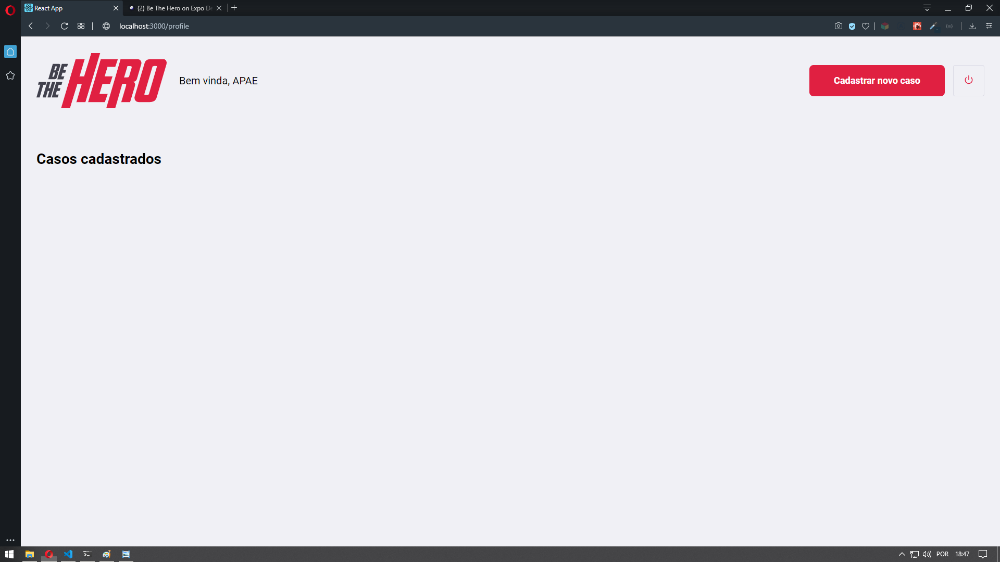
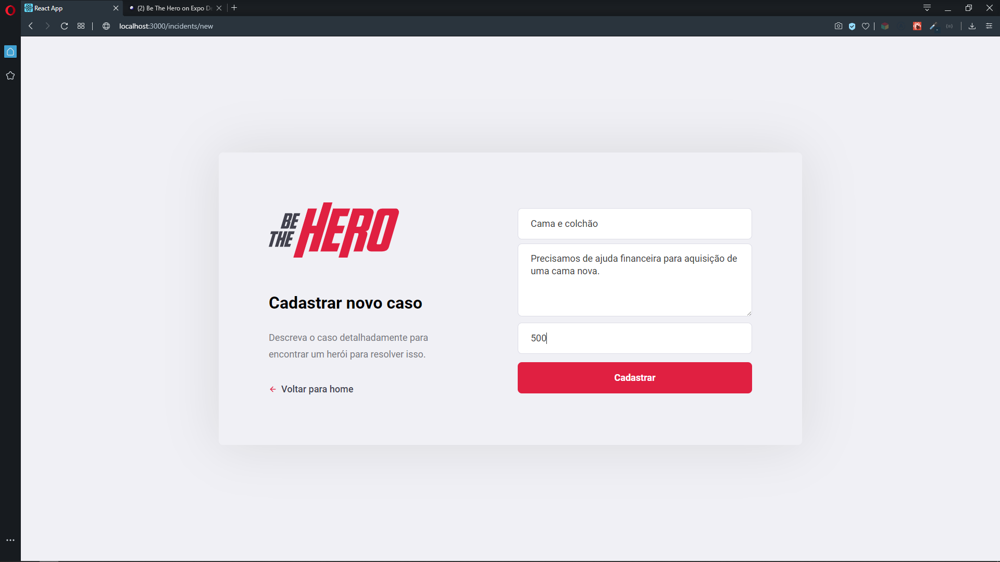
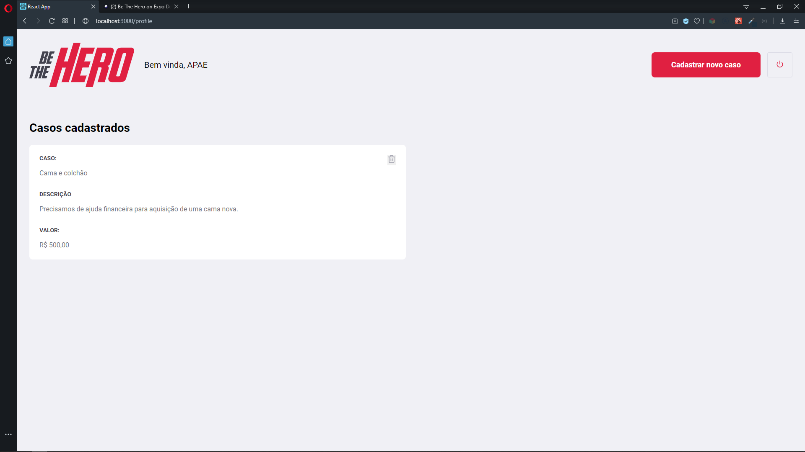
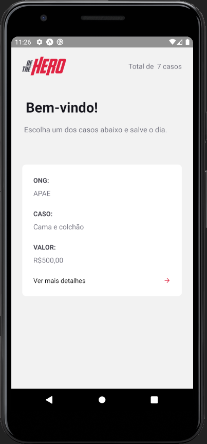
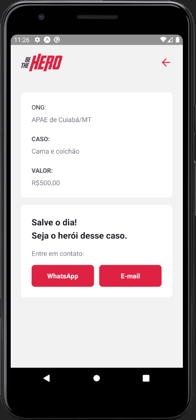
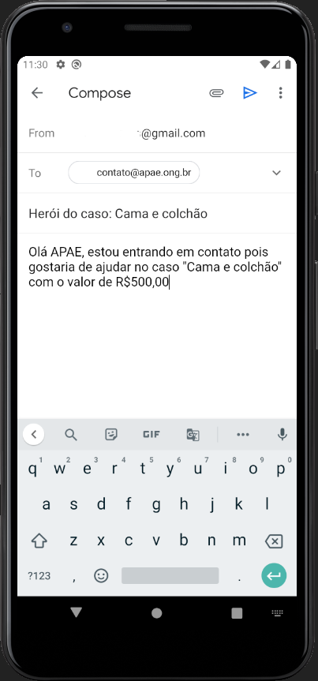

<h1 align="center">Semana Omnistack 11 - Be The Hero</h1>

<p align="center">
    
</p>

# O que é?

  O "Be The Hero" foi o projeto desenvolvido na Semana Omnistack 11. A ideia dele é: ONGs cadastram-se e criam casos com um título, uma descrição e um valor. Por exemplo: uma ONG cria um caso de uma cadelinha atropelada e precisa de R$300,00 para bancar uma cirurgia. Esses casos aparecem no aplicativo móvel e o usuário tem a opção de entrar em contato com a ONG por E-mail ou WhatsApp para ajudar e "Ser o Herói" do caso .

# Exemplo de utilização:

<h2 align="center">Ao entrar na aplicação web, a ONG tem duas opções, inserir o ID e logar ou se cadastrar.</h2>
<p align="center">
  
</p>

<h2 align="center">Após a ONG se cadastrar, aparecerá um "alert" dizendo seu ID de acesso.</h2>
<p align="center">
  
</p>

<h2 align="center">Com esse ID, a ong poderá realizar login.</h2>
<p align="center">
  
</p>

<h2 align="center">Logada, a ONG terá duas opções, registrar um novo caso ou realizar logoff.</h2>
<p align="center">
  
</p>

<h2 align="center">Para registrar um novo caso é necessário um título, uma descrição e um valor. </h2>
<p align="center">
  
</p>

<h2 align="center">Quando o caso estiver registrado ele será exibido no página home com a opção de exclui-lo. </h2>
<p align="center">
  
</p>

<h2 align="center">Já na home do aplicativo mobile aparecerá os casos de todas as ONGS. </h2>
<p align="center">
  
</p>

<h2 align="center">Ao clicar em "ver mais detalhes" o usuário será redirecionado para uma tela onde ele poderá entrar em contato com a ONG. </h2>
<p align="center">
  
</p>

<h2 align="center">Ao clicar na opção do E-mail ou do Whatsapp abrirá o respectivo aplicativo já no contato da ONG e com uma mensagem padrão. </h2>
<p align="center">
  
</p>

# Para rodar no seu computador:

1. Clone o repositório
2. Rode ```npm/yarn install``` em ```./backend```, ```./frontend``` e ```./mobile```.
3. Rode ```npx knex migrate:latest``` em ```./backend```
4. Rode ```npm run/yarn start``` em ```./backend```, ```./frontend``` e ```./mobile```.

Pronto! O servidor já estará rodando, o frontend web vai abrir no navegador padrão e o mobile pode ser acessado pelo aplicativo ```EXPO``` no celular tendo que escanear o código QR que abrirá no terminal. Por padrão as portas 3000, 3333 e 19000 serão usadas.

# Testes automatizados

Dois testes estão disponíveis. O primeiro testa a criação de ONGs, para executa-lo rode ```npm run/yarn test``` em ```./backend```. O segundo testa a geração de IDs, para executa-lo rode ``` npm run/yarn test``` em ```./backend/tests/unit```.
